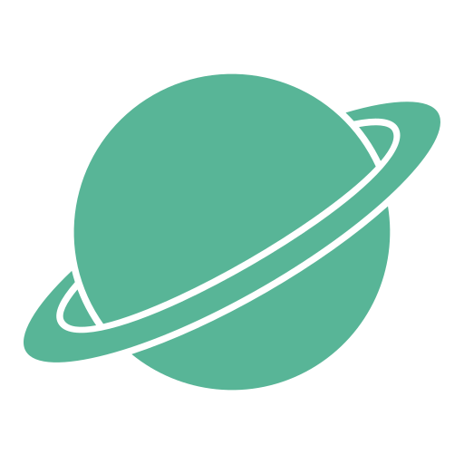

<h1 align="center">Solar System</h1>

<h5 align="center">🌎​ Interactive Solar System 3D replica 🪐</h5>

  
  

### 

<h3 align="center"><a href="https://honzaap.github.io/SolarSystem">Try it out!</a></h3>

### 

Made with <a href="https://github.com/mrdoob/three.js">ThreeJS</a> and <a href="https://github.com/vuejs/core">Vue</a>

### How does it work? 
- Move around the Solar system with mouse
- Click on planet or moon to find out more about it 
- Change the speed  with side menu

### How to install
- Clone repository to your local machine
- Open terminal and cd into repository folder
- run npm install
- run npm run dev
